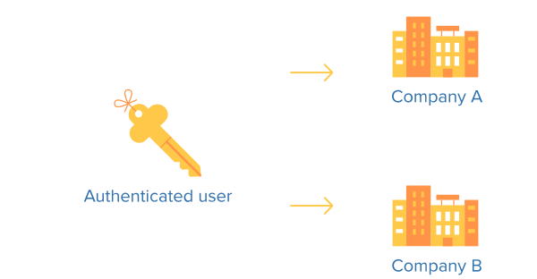
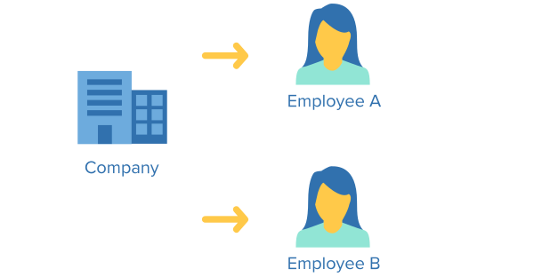
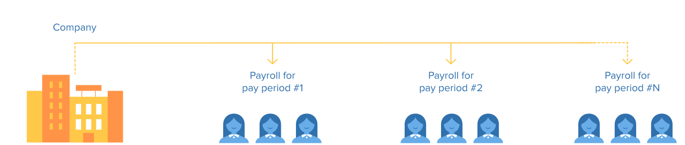

# Introduction

## A Developer's Best Friend

Welcome to Gusto's API documentation. This site serves as both a technical reference for the endpoints available and a general overview of payroll. We designed the objects and their properties to require as little domain-specific payroll knowledge as possible.

### Getting Started

Gusto is steadily opening its API to partners who would like to build integrations to Gusto. If you’d like to be considered for a future integration partnership, please complete [this short application](https://gusto.stoplight.io/docs/gusto-api/docs/contact/Request%20API%20Access.md).

Existing partners have been given API credentials. These include the application id and secret necessary to interact with any part of the Gusto API. Next, you'll want to successfully authenticate a user using OAuth. The [Authentication Example](https://gusto.stoplight.io/docs/gusto-api/docs/basics/Authentication.md) has everything you need to get started.

### Payroll Basics

Payroll in its entirety is rather complex, but the API is designed to shield as much complexity as possible from the end user, without sacrificing functionality. This section gives a birds-eye view of the objects that make up the Gusto system.

Starting with an authenticated user, you will notice that they may be administrators for multiple companies. This is not uncommon, and your application should prepare for it. Accountants use Gusto to manage payroll for many companies simultaneously.

Companies themselves are, naturally, a collection of one to hundreds of employees. Employee data, on the payroll side, is relatively static. Compensation information, addresses, and tax information changes rather infrequently once set.

Companies can have multiple work locations, across multiple states, but everyone gets paid at the same time.

Pay periods are the combination of a company, a subset of its employees, and a time range. Not every employee at a company will be a part of every payroll. One-off (or'off-cycle') payrolls are run for special events such as hiring or termination, and employees can be excluded from payrolls.

Regular payrolls are tied to a specific pay periods, and all associated information - vacation & sick time, hours worked, bonuses, etc. - should be applied to that time range.

