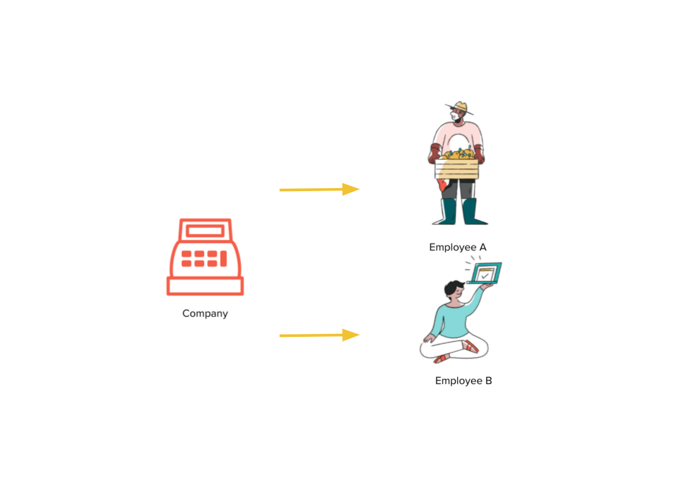
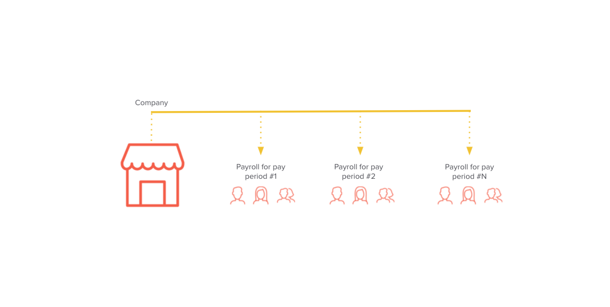
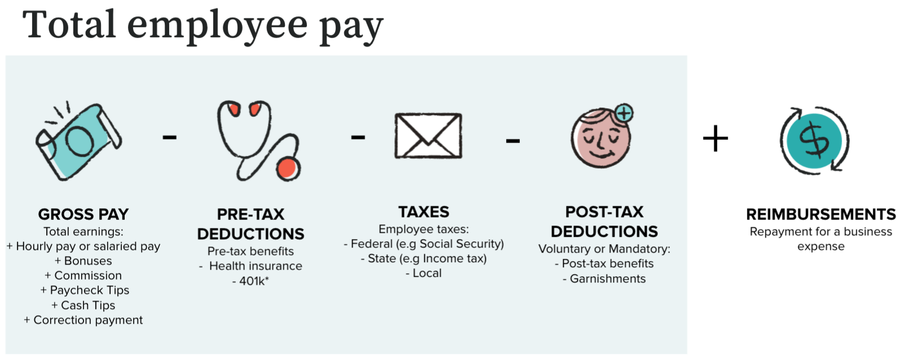
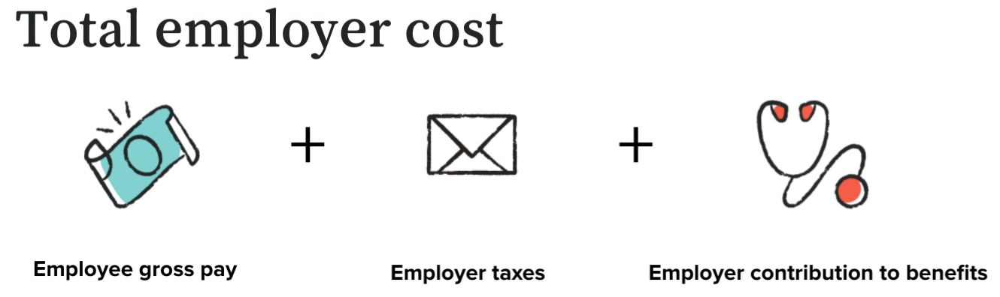

# Payroll Fundamentals

Payroll in its entirety is rather complex, but the API is designed to shield as much complexity as possible from the end user, without sacrificing functionality. This section gives a birds-eye view of the objects that make up the [Gusto system](gusto.com):

### Companies and employees

Let’s start with companies and employees. Companies themselves are, naturally, a collection of one to hundreds of employees. Employee data, on the payroll side, is relatively static. Compensation information, addresses, and tax information changes rather infrequently once set.

To onboard a company for payroll, key inputs include company details (e.g. name, EIN), location, bank accounts, and other information. To onboard an employee, key inputs include employee details (e.g. name, addresses), pay rates (salaried or hourly), benefits deductions, tax withholding, and so on. Once set up, these change rather infrequently.

Companies can have multiple work locations, across multiple states, but everyone on the same pay schedule gets paid at the same time. Companies can have multiple pay schedules which means there can be multiple day dates for Employees.

### Payroll

Now let’s talk about the key inputs to payroll.

Regular payrolls are tied to a specific pay period and all associated information - paid time off (vacation, sick, holiday, custom policies), hours worked, bonuses, commissions, etc. - should be applied to that time range.  In a regular payroll, the Company payroll admin sets the pay schedule (e.g. monthly, bi-monthly) and the start date. From there, each payroll is associated with a specific pay period with a start and end date, to make sure there are no overlapping dates. 

It’s important to recognize that a company can have multiple pay schedules, typically one for salaried employees and another one for hourly employees.

Pay periods are the foundation of payroll. Compensation, time and attendance, taxes, and expense reports all rely on when they happened. These are the combination of a company, a subset of its employees, and a time range. Not every employee at a company will be a part of every payroll. Pay periods have a `start_date` and an `end_date`. To begin submitting information for a given payroll, we need to agree on the time period.

Majority of payrolls are run regularly, while some are [‘off-cycle’](https://support.gusto.com/payroll/processing-payrolls/off-cycle-payrolls/999908231/Run-an-off-cycle-payroll.htm) to take care of one-off events such as [corrections](https://support.gusto.com/payroll/processing-payrolls/off-cycle-payrolls/1019772541/Reasons-for-running-an-off-cycle-payroll.htm). Off-cycle payrolls default to using the same withholding rates, deductions, and contributions made in regular payrolls.

### Employee pay and Employer cost

It all starts with what an employer owes an employee: an employee’s gross pay. Gross pay is the amount of money employees receive before any taxes and deductions are taken out. An employee can be salaried or hourly, and also receive additional earnings throughout the course of their employment. We refer to these earnings as [compensations](https://docs.gusto.com/docs/api/reference/Gusto-API.v1.yaml/paths/~1v1~1compensations~1%7Bcompensation_id%7D/get) in the API. Salaries and additional earnings such as bonuses, commissions, and tips are `fixed_compensations `and wages calculated by the hour are referred to as `hourly_compensations`.

Use the `flsa_status` in the [compensations endpoint](https://docs.gusto.com/docs/api/reference/Gusto-API.v1.yaml/paths/~1v1~1compensations~1%7Bcompensation_id%7D/get) to determine if an employee is hourly or salaried. 

Next, employee pre-tax deductions such as health insurance are subtracted from gross pay. Then, federal, state and local taxes are calculated from that, depending on where the employee worked. From there, post-tax deductions such as garnishments are subtracted and reimbursable expenses are added. To sum it up, net pay is what the employee takes home, after the voluntary and/or mandatory deductions and taxes are subtracted, and can be received via ACH direct deposit or physical check. 

With the exception of child support, Gusto does not debit for garnishments on behalf of the user, so the user will be liable to make this payment from their end. For this reason, we do not surface garnishments in the payroll totals (except child support) so you'll need to examine individual employees in the payroll response for `deductions`. These will be separate line items from `benefits` or `employee_benefits_deductions`. *Gusto remits payment for most U.S States except South Carolina, US Territories, and Tribal Support Agency.*

